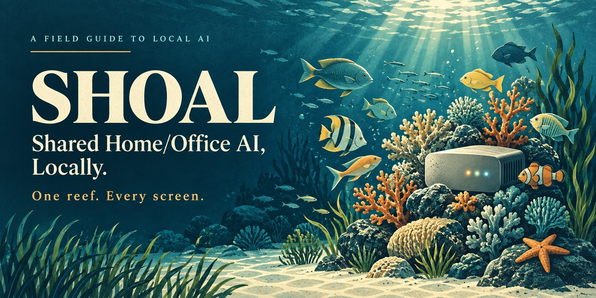
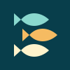

# SHOAL

**Shared Home/Office AI, Locally**

[](docs/reef-setup.md)

**[Build your reef](docs/reef-setup.md)** · **[Connect your devices](docs/fish-guide.md)** · **[Choose your hardware](#reference-builds)**

[How it works](#how-it-works) · [Explore the guides](#explore-the-guides) · [Project status](#project-status) · [Images & icons](#images-icons-and-sharing)

One box on the network.

Every device talks to it.

Your AI. On your terms.

SHOAL is a field guide to shared local AI for homes and small offices. One machine runs the models. Everyone reaches it through a browser. The laptop at your desk, the tablet on the couch, the phone in your pocket: different screens, the same reef.

Think of the home media-server pattern, applied to AI.

> Don't swim with the big fish and risk getting eaten. Play it safe in the warm, clear, shallow waters you control. And when you need to go deep? You're just a few paddles out of the safe harbor to the big ocean.

**Start here:** this repository contains setup guides, reference builds, and research. Your application is Open WebUI running on your own reef. There is no public SHOAL chat service or hosted demo.

## How it works

```text
YOUR DEVICES                 YOUR REEF
Laptop  ─┐                  One shared local host
Tablet  ─┼── Browser / LAN ──▶ Open WebUI ──▶ Ollama ──▶ Local models
Phone   ─┘                    Accounts       Inference
```

The browser is the front door. Open WebUI is the shared workspace. Ollama runs the models behind it.

| In the shoal | In practice |
|---|---|
| **Reef** | The inference host, running Ollama and Open WebUI. |
| **Fish** | Your laptops, tablets, phones, and Chromebooks. A browser is the client. |
| **Shoal** | The home or office network connecting them. |
| **Ocean** | Optional cloud APIs when you choose an external service. |

The documented core is [Ollama](https://docs.ollama.com/) + [Open WebUI](https://docs.openwebui.com/). The [remote-access guide](docs/remote-access.md) covers an optional Tailscale path back to your reef.

## Find your starting point

| You want to… | Start here |
|---|---|
| Put a spare machine to work | [Compare the reference builds](#reference-builds) |
| Set up the shared AI host | [Build your reef](docs/reef-setup.md) |
| Connect a phone, tablet, or laptop | [Connect your fish](docs/fish-guide.md) |
| Give people their own accounts | [Users, roles, and access](docs/multi-user.md) |
| Understand what stays local | [The privacy case](docs/privacy-case.md) |
| Compare ownership with subscriptions | [The cost comparison](docs/cost-comparison.md) |

Once your reef is configured, open its Open WebUI address and sign in. Your reef administrator supplies that address. The [client guide](docs/fish-guide.md) explains how to find it.

## Reference builds

Three starting points. One shared-server pattern.

| Build | Hardware direction | Explore |
|---|---|---|
| **Budget Reef** | A refurbished small desktop PC | [Reuse hardware and start small](builds/budget-reef.md) |
| **Sweet Spot Reef** | A compact Apple Silicon Mac mini | [Explore the compact desktop build](builds/sweet-spot-reef.md) |
| **Power Reef** | A higher-memory Mac mini Pro or Mac Studio | [Explore the larger-memory build](builds/power-reef.md) |

These are reference designs from the June 2026 research, not a current shopping list. Recheck specifications, prices, model fit, and simultaneous-user performance before buying. A build guide is a starting hypothesis; your workload is the test.

## Why build a shoal?

**Share the hardware.** Put the compute in one place and use the screens you already own.

**Choose what leaves.** Local inference gives you more control over where prompts are processed. Cloud models, web search, integrations, and backups need their own data-flow review. [Ollama documents the distinction between local and cloud use](https://docs.ollama.com/faq).

**Understand the cost.** Compare hardware, electricity, maintenance, and any optional services against the subscriptions you would actually replace. The [cost guide](docs/cost-comparison.md) records the original assumptions; it is not a current quote or a savings guarantee.

**Keep the choice.** Stay in the shallows for local work. Go to the ocean when the task calls for it.

Local hosting still needs care: strong accounts, restricted network access, encrypted backups, patching, and physical access controls. Keep Ollama's unauthenticated API off the public internet. See the [privacy](docs/privacy-case.md) and [remote-access](docs/remote-access.md) guides before opening access beyond your shoal.

## Explore the guides

| Guide | What you will find |
|---|---|
| [Reef setup](docs/reef-setup.md) | The documented Ollama + Open WebUI installation path |
| [Fish guide](docs/fish-guide.md) | Browser access from Windows, Mac, Chromebook, iOS, and Android |
| [Multi-user setup](docs/multi-user.md) | Accounts, roles, groups, and model access |
| [Remote access](docs/remote-access.md) | The optional Tailscale route back home |
| [Cost comparison](docs/cost-comparison.md) | Ownership costs and subscription assumptions |
| [Privacy case](docs/privacy-case.md) | Local control, data exposure, and operational responsibilities |
| [OpenClaw gateway integration](docs/openclaw-gateway-integration.md) | An optional agent layer beyond the core stack |
| [Technology inventory](docs/technology-inventory.md) | Documented technologies and dated version evidence |
| [Technology update plan](docs/technology-update-plan.md) | Release review, compatibility checks, and host upgrades |
| [Program status](docs/program-status.md) | Dated progress and blockers across the related projects |

Version-specific setup commands and product behavior need checking against current upstream documentation before use. A release baseline in this repository does not establish what is installed on a reef.

## Project status

**Available here:** documentation, hardware reference builds, dated research, and contributor Agent Skills.

**Not shipped here:** a SHOAL server implementation, deployment automation, a hosted application, or a project-wide test suite. Contributor skills have separate helpers and tests.

The [program-status tracker](docs/program-status.md) records earlier operational observations. Read its date before treating those observations as current. Live reef readiness is tracked separately from this reference documentation.

The [update plan](docs/technology-update-plan.md) describes configured Renovate reviews. Hosted App activation and successful scheduled execution require separate verification.

## Images, icons, and sharing

<p>
  
</p>

A sunlit reef for the big picture. A small school of fish for the small screens.

| Asset | Files |
|---|---|
| **README and social image** | [Social preview](assets/brand/social-preview.jpg) |
| **Scalable project icon** | [SVG](assets/brand/icon.svg) |
| **Browser favicons** | [ICO](assets/brand/favicon.ico) · [16 px](assets/brand/favicon-16.png) · [32 px](assets/brand/favicon-32.png) |
| **Home-screen icons** | [Apple touch icon](assets/brand/apple-touch-icon.png) · [192 px](assets/brand/icon-192.png) · [512 px](assets/brand/icon-512.png) |
| **Safari pinned-tab icon** | [Monochrome SVG](assets/brand/safari-pinned-tab.svg) |
| **Page metadata** | [Open Graph, social cards, icons, and publishing notes](docs/branding.md) |

The illustration is conceptual artwork, not a product screenshot. These are project presentation assets. Website metadata and installed icons need a hosted page; adding files to this README does not activate them. See the [asset guide](docs/branding.md) for the exact handoff and publication status.

## Around the reef

SHOAL belongs to the **OverKill Hill P³** ecosystem: Precision, Protocol, Promptcraft.

| Project | Role |
|---|---|
| [Mac Studio Local AI Workbench](https://github.com/OKHP3/mac-studio-local-ai-workbench) | Compute infrastructure context |
| [Infusing a Soul](https://github.com/OKHP3/infusing-a-soul) | AI persona architecture context |
| **SHOAL** | The shared local-server pattern |

For source material, explore [research/](research/). For durable project context, see [context/](context/). Contributor tooling lives in [.agents/skills/](.agents/skills/), with selected publication mirrors in [skills/](skills/). The `article/drafts/` and `configs/example-configs/` directories remain staging areas.

Start contributions with [AGENTS.md](AGENTS.md). Keep examples portable, sources dated, and private machine details out of the repository.

## License

[MIT](LICENSE). Configuration guides, methodology, and the accompanying project artwork are shared under the repository license. Upstream software and model licenses apply separately.

---

One reef. Every screen. A shoal of your own.

*Built by Jamie Hill · [OverKill Hill P³](https://overkillhill.com)*
